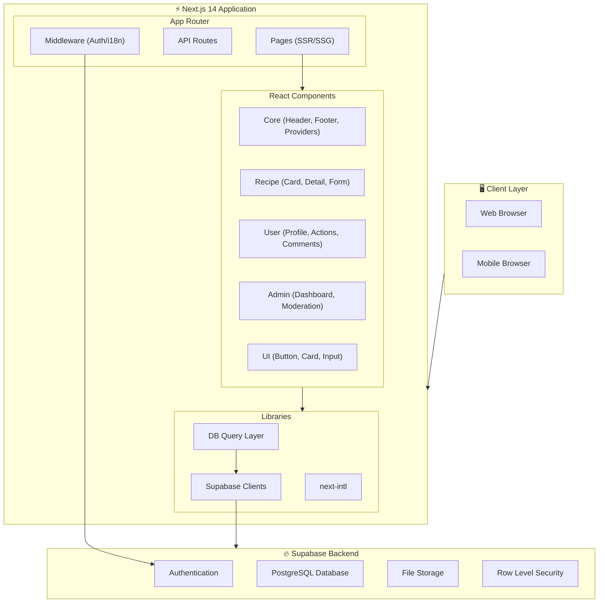
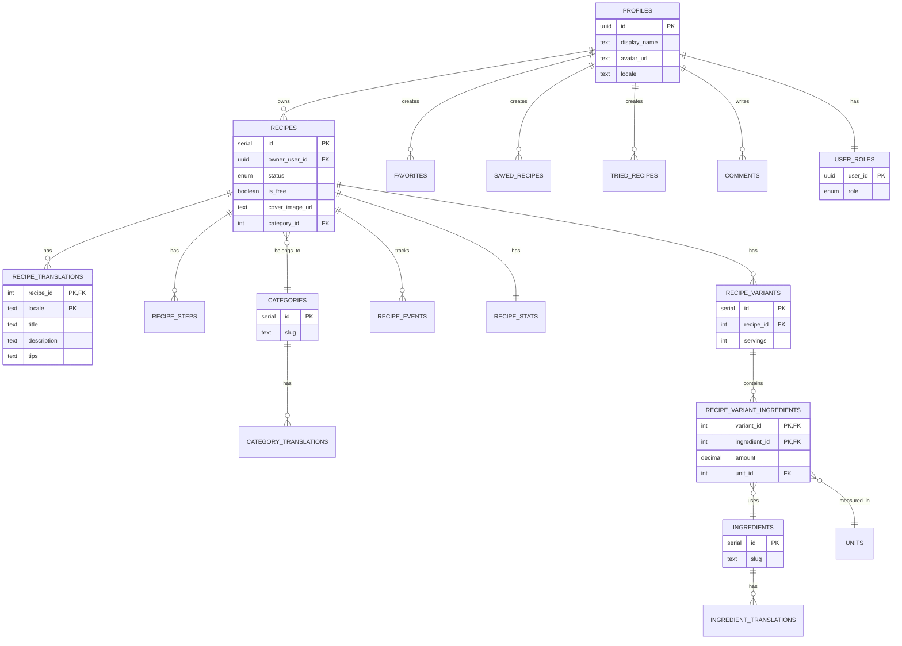
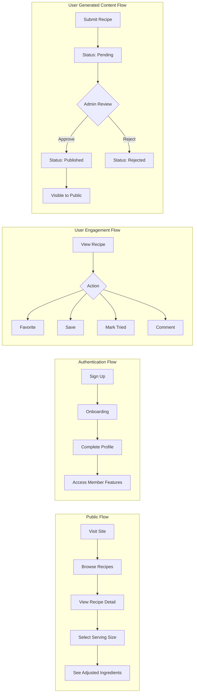
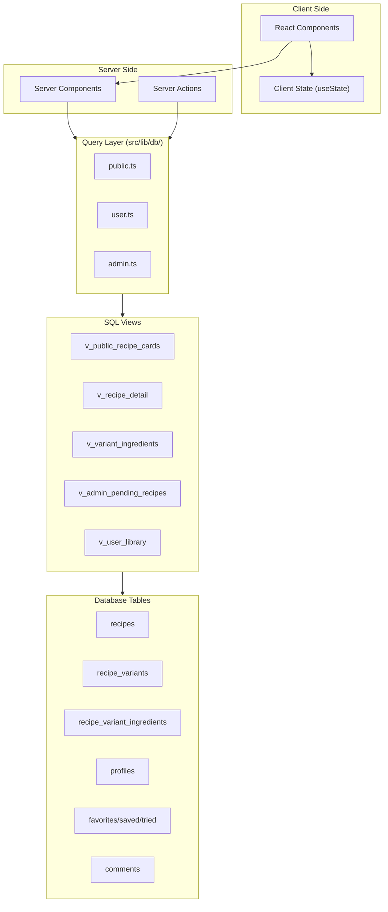
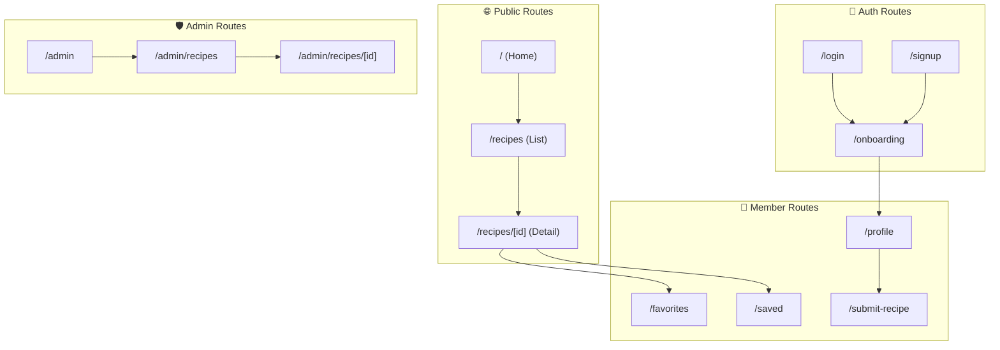

# 🍳 Recipio - Minimalist Recipe Platform

<div align="center">


**Recipio** is a minimalist, bilingual (Turkish/English) recipe platform with a unique non-linear serving size variant system.

[Features](#-features) • [Architecture](#-architecture) • [Installation](#-installation) • [Development Sessions](#-development-sessions)

</div>

---

## 📖 About The Project

Recipio is a full-stack recipe website built with modern web technologies. The key differentiator is the **non-linear serving size variants** - a recipe for 2 servings has a completely distinct ingredient list from the same recipe for 4 servings, rather than simple multiplication.

### 🎯 Core Goals

- **Minimalist Design**: Clean, modern interface with black/white theme and accent colors
- **Bilingual Support**: Full Turkish and English localization
- **Smart Portion System**: Customized ingredient lists for each serving size
- **User Engagement**: Favorites, bookmarks, comments, and recipe submissions
- **Admin Management**: Moderation system for user-submitted content

---

## ✨ Features

### 🌐 Public (Anonymous Users)
- Browse free, published recipes
- Search and filter recipes by category
- Switch between English and Turkish
- View recipe details (ingredients, steps, statistics)
- Dynamic ingredient list with serving size selector

### 👤 Registered Users
- All public features
- Add recipes to favorites
- Save recipes to personal library
- Mark recipes as "tried"
- Comment on recipes
- Submit own recipes for moderation
- Manage profile (display name, avatar, locale preference)

### 🛡️ Admin Users
- All user features
- Review and approve/reject pending recipes
- Hide inappropriate comments
- Manage site content

---

## 🏗️ Architecture

### High-Level System Architecture



### Database Schema



### Application Flow



### Component Architecture

```mermaid
flowchart TB
    subgraph AppShell["Application Shell"]
        Layout["layout.tsx"]
        Providers["Providers.tsx"]
        Header["Header.tsx"]
        Footer["Footer.tsx"]
    end
    
    subgraph Pages["Page Components"]
        Home["Home Page"]
        RecipeList["Recipe List Page"]
        RecipeDetail["Recipe Detail Page"]
        Profile["Profile Page"]
        Favorites["Favorites Page"]
        SubmitRecipe["Submit Recipe Page"]
        AdminDashboard["Admin Dashboard"]
    end
    
    subgraph RecipeComponents["Recipe Components"]
        RecipeCard["RecipeCard.tsx"]
        RecipeDetailComp["RecipeDetail.tsx"]
        RecipeForm["RecipeForm.tsx"]
        ServingsStepper["ServingsStepper.tsx"]
        IngredientsList["IngredientsList.tsx"]
        StepsList["StepsList.tsx"]
    end
    
    subgraph UserComponents["User Components"]
        UserActions["UserActions.tsx"]
        Comments["Comments.tsx"]
        ProfileForm["ProfileForm.tsx"]
    end
    
    subgraph AdminComponents["Admin Components"]
        PendingList["PendingRecipesList.tsx"]
        ModerationControls["ModerationControls.tsx"]
    end
    
    Layout --> Providers
    Providers --> Header
    Providers --> Pages
    Providers --> Footer
    
    Home --> RecipeCard
    RecipeList --> RecipeCard
    RecipeDetail --> RecipeDetailComp
    RecipeDetail --> ServingsStepper
    RecipeDetail --> IngredientsList
    RecipeDetail --> StepsList
    RecipeDetail --> UserActions
    RecipeDetail --> Comments
    
    Profile --> ProfileForm
    Favorites --> RecipeCard
    SubmitRecipe --> RecipeForm
    
    AdminDashboard --> PendingList
    AdminDashboard --> ModerationControls
```



### Data Flow Architecture



### Route Structure



### Tech Stack

| Technology | Purpose |
|------------|---------|
| **Next.js 14** | React framework with App Router, SSR/SSG |
| **TypeScript** | Type safety and developer experience |
| **Supabase** | PostgreSQL database, Auth, RLS |
| **Tailwind CSS** | Utility-first CSS framework |
| **next-intl** | Internationalization (i18n) |
| **next-themes** | Theme management (dark/light mode) |
| **Framer Motion** | Animations and transitions |
| **Lucide React** | Icon library |

### SQL Views Summary

| View | Purpose | Used By |
|------|---------|---------|
| `v_public_recipe_cards` | Public recipe listings with translations & stats | Home, Recipe List |
| `v_recipe_detail` | Complete recipe data with all translations | Recipe Detail Page |
| `v_variant_ingredients` | Serving-specific ingredient lists | Serving Stepper |
| `v_admin_pending_recipes` | Pending recipes for moderation | Admin Dashboard |
| `v_user_library` | User's favorited/saved/tried recipes | User Library Pages |

### RLS (Row Level Security) Strategy

| Role | Permissions |
|------|-------------|
| **Anonymous** | Read published & free recipes, create view events |
| **Authenticated** | Read all published recipes, manage own recipes, create engagements |
| **Admin** | Full access, recipe moderation, comment management |

---

## 📅 Development Sessions

This project was developed across 3 structured sessions:

| Session | Title | Description | Status | Playlist Link |
|:-------:|-------|-------------|:------:|---------------|
| **1** | 🏗️ Foundation | Database schema, Next.js setup, i18n infrastructure, public pages (Home, Recipe List, Recipe Detail), minimal UI design | ✅ Complete | [Session 1 Playlist](#) |
| **2** | 🔐 Auth & User Features | Supabase authentication, onboarding flow, favorite/save/tried features, comment system, user profile and library pages | 🔄 Planned | [Session 2 Playlist](#) |
| **3** | 👑 Admin & UGC | Recipe submission form, admin dashboard, moderation system, UI/UX improvements | 📋 Planned | [Session 3 Playlist](#) |

### Session 1: Foundation - Detailed

**Goals:**
- ✅ Create database schema and seed data
- ✅ Set up Next.js project with all dependencies
- ✅ Implement i18n (multi-language) infrastructure
- ✅ Build public pages (Home, Recipes, Recipe Detail)
- ✅ Design minimal black/white + accent color UI

**Files Created:**

```
📁 supabase/
├── migrations/0001_init.sql      # Table definitions
├── migrations/0002_views.sql     # SQL views
└── seed/seed.sql                 # Test data

📁 src/
├── app/layout.tsx                # Root layout
├── app/page.tsx                  # Home page
├── components/core/              # Header, Footer, Providers
├── components/i18n/              # Language switcher
├── lib/supabase/                 # Supabase clients
└── lib/db/public.ts              # Public query functions
```

**Acceptance Criteria:**
- [x] Database can be fully migrated and seeded using Supabase CLI
- [x] App runs without errors
- [x] Homepage displays featured recipes from `v_public_recipe_cards`
- [x] Language switcher correctly changes locale

### Session 2: Auth & User Features - Detailed

**Goals:**
- 🔲 Supabase authentication integration (Login, Signup)
- 🔲 Onboarding flow for new users
- 🔲 Favorite, save, tried buttons on recipes
- 🔲 Comment system
- 🔲 User profile and library pages

**Files to Create:**

```
📁 src/app/[locale]/
├── (auth)/login/page.tsx
├── (auth)/signup/page.tsx
├── onboarding/page.tsx
├── profile/page.tsx
├── favorites/page.tsx
└── saved/page.tsx

📁 src/components/
├── auth/AuthForm.tsx
└── user/UserActions.tsx, Comments.tsx, ProfileForm.tsx
```

### Session 3: Admin & UGC - Detailed

**Goals:**
- 🔲 Recipe submission form
- 🔲 Admin dashboard
- 🔲 Moderation system (approve/reject)
- 🔲 UI/UX final polish

**Files to Create:**

```
📁 src/app/[locale]/
├── submit-recipe/page.tsx
└── admin/
    ├── page.tsx
    └── recipes/[id]/page.tsx

📁 src/components/
├── recipe/RecipeForm.tsx
└── admin/PendingRecipesList.tsx, ModerationControls.tsx
```

---

## 🚀 Installation

### Prerequisites

- Node.js 18+
- npm or yarn
- Supabase CLI
- Docker (for local Supabase)

### 1. Clone the Repository

```bash
git clone https://github.com/your-username/recipio.git
cd recipio
```

### 2. Install Dependencies

```bash
npm install
```

### 3. Set Up Environment Variables

Create a `.env.local` file in the project root:

```env
# Supabase connection details
NEXT_PUBLIC_SUPABASE_URL=http://127.0.0.1:54321
NEXT_PUBLIC_SUPABASE_ANON_KEY=your-local-anon-key
SUPABASE_SERVICE_ROLE_KEY=your-local-service-role-key
```

> 💡 Get Supabase URL and key by following instructions in `/supabase/README.md`

### 4. Start Supabase

```bash
# Start Supabase services
npx supabase start

# Apply migrations and seed data
npx supabase db reset
```

### 5. Start Development Server

```bash
npm run dev
```

Open [http://localhost:3000](http://localhost:3000) in your browser.

---

## 📁 Project Structure

```
recipio/
├── 📁 docs/                      # Project documentation
│   ├── ANALYSIS.md               # Detailed analysis and architecture
│   ├── DB_SCHEMA.md              # Database schema summary
│   ├── ROUTES_AND_QUERIES.md     # Route-Query mapping
│   └── SESSION_PLAN.md           # Session plan details
│
├── 📁 public/                    # Static files
│   └── assets/                   # Images, icons
│
├── 📁 src/                       # Application source code
│   ├── 📁 app/                   # Next.js App Router
│   │   ├── layout.tsx            # Root layout
│   │   ├── page.tsx              # Home page
│   │   ├── home/                 # Home page components
│   │   └── splash/               # Splash screen
│   │
│   ├── 📁 components/            # React components
│   │   ├── core/                 # Header, Footer, Providers
│   │   ├── i18n/                 # Language components
│   │   ├── recipe/               # Recipe components
│   │   └── ui/                   # General UI components
│   │
│   ├── 📁 lib/                   # Helper libraries
│   │   ├── db/                   # Database queries
│   │   └── supabase/             # Supabase clients
│   │
│   ├── 📁 localizations/         # Translation files
│   │   ├── en.json               # English
│   │   └── tr.json               # Turkish
│   │
│   ├── 📁 styles/                # Global styles
│   │   └── globals.css
│   │
│   ├── i18n.ts                   # i18n configuration
│   └── middleware.ts             # Next.js middleware
│
├── 📁 supabase/                  # Supabase files
│   ├── migrations/               # SQL migrations
│   │   ├── 0001_init.sql         # Table definitions
│   │   └── 0002_views.sql        # SQL views
│   ├── seed/                     # Seed data
│   │   └── seed.sql
│   └── README.md                 # Supabase setup instructions
│
├── .env.local                    # Environment variables (gitignore)
├── next.config.mjs               # Next.js configuration
├── tailwind.config.ts            # Tailwind configuration
├── tsconfig.json                 # TypeScript configuration
└── package.json                  # Project dependencies
```

---

## 📜 Available Scripts

```bash
npm run dev      # Start development server
npm run build    # Create production build
npm run start    # Start production server
npm run lint     # Run ESLint code check
```

---

## 🤝 Contributing

1. Fork the repository
2. Create a feature branch (`git checkout -b feature/amazing-feature`)
3. Commit your changes (`git commit -m 'feat: add amazing feature'`)
4. Push to the branch (`git push origin feature/amazing-feature`)
5. Open a Pull Request

### Commit Types

| Type | Description |
|------|-------------|
| `feat` | New feature |
| `fix` | Bug fix |
| `docs` | Documentation |
| `style` | Code formatting |
| `refactor` | Code restructuring |
| `test` | Adding tests |
| `chore` | Maintenance |

---

## 📄 License

This project is licensed under the MIT License. See the [LICENSE](LICENSE) file for details.

---

<div align="center">

Made with 🍳 by **Recipio Team**

[⬆ Back to Top](#-recipio---minimalist-recipe-platform)

</div>
