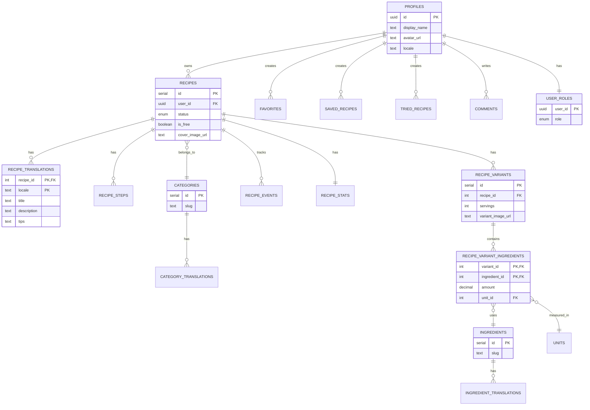
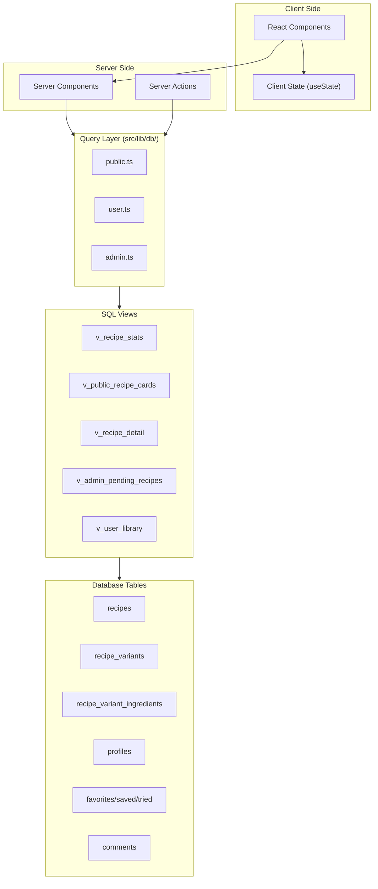

# 🍳 Recipio - Minimalist Recipe Platform

<div align="center">


**Recipio** is a minimalist, bilingual (Turkish/English) recipe platform with a unique non-linear serving size variant system.

[Features](#-features) • [Architecture](#-architecture) • [Installation](#-installation) • [Development Sessions](#-development-sessions)

</div>

---

## 📖 About The Project

Recipio is a full-stack recipe website built with modern web technologies. The key differentiator is the **non-linear serving size variants** - a recipe for 2 servings has a completely distinct ingredient list from the same recipe for 4 servings, rather than simple multiplication.

### 🎯 Core Goals

- **Minimalist Design**: Clean, modern interface with black/white theme and accent colors
- **Bilingual Support**: Full Turkish and English localization
- **Smart Portion System**: Customized ingredient lists for each serving size
- **User Engagement**: Favorites, bookmarks, comments, and recipe submissions
- **Admin Management**: Moderation system for user-submitted content

---

## ✨ Features

### 🌐 Public (Anonymous Users)
- Browse free, published recipes
- Search and filter recipes by category
- Switch between English and Turkish
- View recipe details (ingredients, steps, statistics)
- Dynamic ingredient list with serving size selector

### 👤 Registered Users
- All public features
- Add recipes to favorites
- Save recipes to personal library
- Mark recipes as "tried"
- Comment on recipes
- Submit own recipes for moderation
- Manage profile (display name, avatar, locale preference)

### 🛡️ Admin Users
- All user features
- Review and approve/reject pending recipes
- Hide inappropriate comments
- Manage site content

---

## 🏗️ Architecture

### High-Level System Architecture


### Database Schema



### Application Flow


### Component Architecture

```mermaid
flowchart TB
    subgraph AppShell["Application Shell"]
        Layout["layout.tsx"]
        Providers["Providers.tsx"]
        Header["Header.tsx"]
        Footer["Footer.tsx"]
    end
    
    subgraph Pages["Page Components"]
        Home["Home Page"]
        RecipeList["Recipe List Page"]
        RecipeDetail["Recipe Detail Page"]
        Profile["Profile Page"]
        Favorites["Favorites Page"]
        SubmitRecipe["Submit Recipe Page"]
        AdminDashboard["Admin Dashboard"]
    end
    
    subgraph RecipeComponents["Recipe Components"]
        RecipeCard["RecipeCard.tsx ✅"]
        RecipeList["RecipeList.tsx ✅"]
        RecipeDetailComp["RecipeDetail.tsx ✅"]
        RecipeForm["RecipeForm.tsx 🔄"]
        ServingsStepper["Integrated in RecipeDetail ✅"]
        IngredientsList["Integrated in RecipeDetail ✅"]
        StepsList["Integrated in RecipeDetail ✅"]
    end
    
    subgraph UserComponents["User Components"]
        UserActions["UserActions.tsx"]
        Comments["Comments.tsx"]
        ProfileForm["ProfileForm.tsx"]
    end
    
    subgraph AdminComponents["Admin Components"]
        PendingList["PendingRecipesList.tsx"]
        ModerationControls["ModerationControls.tsx"]
    end
    
    Layout --> Providers
    Providers --> Header
    Providers --> Pages
    Providers --> Footer
    
    Home --> RecipeList
    RecipeList --> RecipeCard
    RecipeDetail --> RecipeDetailComp
    RecipeDetail --> UserActions
    RecipeDetail --> Comments
    
    Profile --> ProfileForm
    Favorites --> RecipeCard
    SubmitRecipe --> RecipeForm
    
    AdminDashboard --> PendingList
    AdminDashboard --> ModerationControls
```



### Data Flow Architecture



### Route Structure

```mermaid
flowchart TB
    subgraph PublicRoutes["🌐 Public Routes"]
        R1["/ (Home) ✅"]
        R2["/home (Home) ✅"]
        R3["/recipes/[id] (Detail) ✅"]
    end
    
    subgraph AuthRoutes["🔐 Auth Routes"]
        R4["/login"]
        R5["/signup"]
        R6["/onboarding"]
    end
    
    subgraph MemberRoutes["👤 Member Routes"]
        R7["/profile"]
        R8["/favorites"]
        R9["/saved"]
        R10["/submit-recipe"]
    end
    
    subgraph AdminRoutes["🛡️ Admin Routes"]
        R11["/admin"]
        R12["/admin/recipes"]
        R13["/admin/recipes/[id]"]
    end
    
    R1 --> R2
    R2 --> R3
    R4 --> R6
    R5 --> R6
    R6 --> R7
    R3 --> R8
    R3 --> R9
    R7 --> R10
    R11 --> R12
    R12 --> R13
```



### Tech Stack

| Technology | Purpose |
|------------|---------|
| **Next.js 14** | React framework with App Router, SSR/SSG |
| **TypeScript** | Type safety and developer experience |
| **Supabase** | PostgreSQL database, Auth, RLS |
| **Tailwind CSS** | Utility-first CSS framework |
| **next-intl** | Internationalization (i18n) |
| **next-themes** | Theme management (dark/light mode) |
| **Framer Motion** | Animations and transitions |
| **Lucide React** | Icon library |

### SQL Views Summary

| View | Purpose | Used By | Status |
|------|---------|---------|:------:|
| `v_recipe_stats` | Aggregated statistics (view_count, favorite_count, etc.) | Stats display | ✅ |
| `v_public_recipe_cards` | Public recipe listings with translations & stats | Home, Recipe List | ✅ |
| `v_recipe_detail` | **Complete recipe data in ONE query** - includes all variants (1,2,3,4 servings) with ingredients (TR/EN), steps (TR/EN), translations, stats | Recipe Detail Page | ✅ |
| `v_admin_pending_recipes` | Pending recipes for moderation | Admin Dashboard | 🔄 |
| `v_user_library` | User's favorited/saved/tried recipes | User Library Pages | 🔄 |

**Note:** `v_recipe_detail` returns all variant ingredients in a single query, eliminating the need for separate `v_variant_ingredients` view.

### RLS (Row Level Security) Strategy

| Role | Permissions |
|------|-------------|
| **Anonymous** | Read published & free recipes, create view events |
| **Authenticated** | Read all published recipes, manage own recipes, create engagements |
| **Admin** | Full access, recipe moderation, comment management |

---

## 📅 Development Sessions

This project was developed across 3 structured sessions:

| Session | Title | Description | Status | Progress |
|:-------:|-------|-------------|:------:|:--------:|
| **1** | 🏗️ Foundation | Database schema, Next.js setup, public pages (Home, Recipe List, Recipe Detail), minimal UI design | ✅ Complete | 90% - Core features done, i18n pending |
| **2** | 🔐 Auth & User Features | Supabase authentication, onboarding flow, favorite/save/tried features, comment system, user profile and library pages | 🔄 Planned | 0% |
| **3** | 👑 Admin & UGC | Recipe submission form, admin dashboard, moderation system, UI/UX improvements | 📋 Planned | 0% |

### Session 1: Foundation - Detailed

**Goals:**
- ✅ Create database schema and seed data
- ✅ Set up Next.js project with all dependencies
- ✅ Implement i18n (multi-language) infrastructure
- ✅ Build public pages (Home, Recipes, Recipe Detail)
- ✅ Design minimal black/white + accent color UI

**Files Created:**

```
📁 supabase/
├── migrations/0001_init.sql      # ✅ Complete schema (tables, functions, triggers, RLS)
├── migrations/0002_views.sql      # ✅ SQL views (v_recipe_detail, v_public_recipe_cards, etc.)
└── seed/seed.sql                  # ✅ Test data (10 recipes, 20 ingredients, 6 categories)

📁 src/
├── app/
│   ├── layout.tsx                 # ✅ Root layout
│   ├── page.tsx                   # ✅ Home page (with RecipeList)
│   ├── home/page.tsx              # ✅ Alternative home page
│   └── recipes/[id]/page.tsx      # ✅ Recipe detail page
├── components/
│   ├── core/                      # ✅ Header, Footer, Providers, SplashScreen
│   ├── i18n/                      # ✅ Language switcher
│   └── recipe/
│       ├── RecipeCard.tsx         # ✅ Recipe card component
│       ├── RecipeList.tsx         # ✅ Recipe list component (grid layout)
│       └── RecipeDetail.tsx       # ✅ Recipe detail component (with servings selector)
├── lib/
│   ├── supabase/
│   │   ├── browser.ts             # ✅ Client-side Supabase client (@supabase/supabase-js)
│   │   ├── server.ts              # ✅ Server-side Supabase client
│   │   └── middleware.ts          # ✅ Middleware client
│   └── db/
│       └── public.ts              # ✅ Public query functions (getAllPublicRecipes, getRecipeDetails, etc.)
```

**Acceptance Criteria:**
- [x] Database can be fully migrated and seeded using Supabase CLI
- [x] App runs without errors
- [x] Homepage displays all recipes from `v_public_recipe_cards` in grid layout
- [x] Recipe detail page shows complete recipe data from `v_recipe_detail` (single query)
- [x] Servings selector (1, 2, 3, 4 kişilik) dynamically updates ingredient list
- [x] Recipe cards display title, description, image, stats, and category
- [ ] Language switcher correctly changes locale (i18n setup pending)

### Session 2: Auth & User Features - Detailed

**Goals:**
- 🔲 Supabase authentication integration (Login, Signup)
- 🔲 Onboarding flow for new users
- 🔲 Favorite, save, tried buttons on recipes
- 🔲 Comment system
- 🔲 User profile and library pages

**Files to Create:**

```
📁 src/app/[locale]/
├── (auth)/login/page.tsx
├── (auth)/signup/page.tsx
├── onboarding/page.tsx
├── profile/page.tsx
├── favorites/page.tsx
└── saved/page.tsx

📁 src/components/
├── auth/AuthForm.tsx
└── user/UserActions.tsx, Comments.tsx, ProfileForm.tsx
```

### Session 3: Admin & UGC - Detailed

**Goals:**
- 🔲 Recipe submission form
- 🔲 Admin dashboard
- 🔲 Moderation system (approve/reject)
- 🔲 UI/UX final polish

**Files to Create:**

```
📁 src/app/[locale]/
├── submit-recipe/page.tsx
└── admin/
    ├── page.tsx
    └── recipes/[id]/page.tsx

📁 src/components/
├── recipe/RecipeForm.tsx
└── admin/PendingRecipesList.tsx, ModerationControls.tsx
```

---

## 🚀 Installation

### Prerequisites

- Node.js 18+
- npm or yarn
- Supabase CLI
- Docker (for local Supabase)

### 1. Clone the Repository

```bash
git clone https://github.com/your-username/recipio.git
cd recipio
```

### 2. Install Dependencies

```bash
npm install
```

### 3. Set Up Environment Variables

Create a `.env.local` file in the project root:

```env
# Supabase connection details
NEXT_PUBLIC_SUPABASE_URL=https://your-project.supabase.co
NEXT_PUBLIC_SUPABASE_ANON_KEY=your-anon-key-here
```

> 💡 **For local development:** Use `http://127.0.0.1:54321` as URL and get keys from `npx supabase status`  
> **For production:** Get URL and key from Supabase Dashboard → Settings → API  
> See `/supabase/README.md` for detailed instructions

### 4. Start Supabase

```bash
# Start Supabase services
npx supabase start

# Apply migrations and seed data
npx supabase db reset
```

### 5. Start Development Server

```bash
npm run dev
```

Open [http://localhost:3000](http://localhost:3000) in your browser.

---

## 📁 Project Structure

```
recipio/
├── 📁 docs/                      # Project documentation
│   ├── ANALYSIS.md               # Detailed analysis and architecture
│   ├── DB_SCHEMA.md              # Database schema summary
│   ├── ROUTES_AND_QUERIES.md     # Route-Query mapping
│   └── SESSION_PLAN.md           # Session plan details
│
├── 📁 public/                    # Static files
│   └── assets/                   # Images, icons
│
├── 📁 src/                       # Application source code
│   ├── 📁 app/                   # Next.js App Router
│   │   ├── layout.tsx            # Root layout
│   │   ├── page.tsx              # Home page (with RecipeList)
│   │   ├── home/                 # Alternative home page
│   │   ├── recipes/[id]/         # Recipe detail page
│   │   └── splash/               # Splash screen
│   │
│   ├── 📁 components/            # React components
│   │   ├── core/                 # Header, Footer, Providers, SplashScreen
│   │   ├── i18n/                 # Language components
│   │   ├── recipe/               # RecipeCard, RecipeList, RecipeDetail
│   │   └── ui/                   # General UI components
│   │
│   ├── 📁 lib/                   # Helper libraries
│   │   ├── db/                   # Database queries
│   │   └── supabase/             # Supabase clients
│   │
│   ├── 📁 localizations/         # Translation files
│   │   ├── en.json               # English
│   │   └── tr.json               # Turkish
│   │
│   ├── 📁 styles/                # Global styles
│   │   └── globals.css
│   │
│   ├── i18n.ts                   # i18n configuration
│   └── middleware.ts             # Next.js middleware
│
├── 📁 supabase/                  # Supabase files
│   ├── migrations/               # SQL migrations
│   │   ├── 0001_init.sql         # Table definitions
│   │   └── 0002_views.sql        # SQL views
│   ├── seed/                     # Seed data
│   │   └── seed.sql
│   └── README.md                 # Supabase setup instructions
│
├── .env.local                    # Environment variables (gitignore)
├── next.config.mjs               # Next.js configuration
├── tailwind.config.ts            # Tailwind configuration
├── tsconfig.json                 # TypeScript configuration
└── package.json                  # Project dependencies
```

---

## 📜 Available Scripts

```bash
npm run dev      # Start development server
npm run build    # Create production build
npm run start    # Start production server
npm run lint     # Run ESLint code check
```

---

## 🤝 Contributing

1. Fork the repository
2. Create a feature branch (`git checkout -b feature/amazing-feature`)
3. Commit your changes (`git commit -m 'feat: add amazing feature'`)
4. Push to the branch (`git push origin feature/amazing-feature`)
5. Open a Pull Request

### Commit Types

| Type | Description |
|------|-------------|
| `feat` | New feature |
| `fix` | Bug fix |
| `docs` | Documentation |
| `style` | Code formatting |
| `refactor` | Code restructuring |
| `test` | Adding tests |
| `chore` | Maintenance |

---

## 📄 License

This project is licensed under the MIT License. See the [LICENSE](LICENSE) file for details.

---

<div align="center">

Made with 🍳 by **Recipio Team**

[⬆ Back to Top](#-recipio---minimalist-recipe-platform)

</div>
